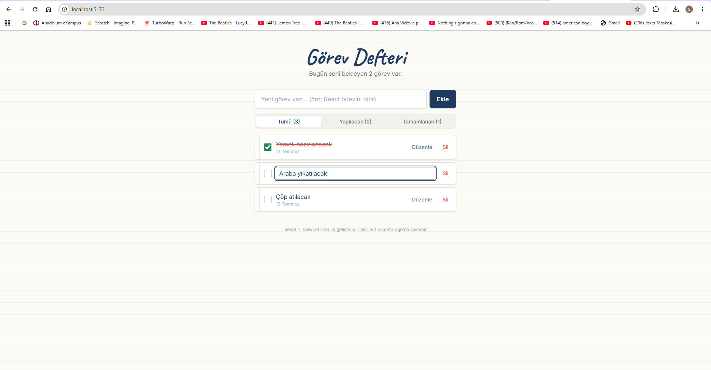

# 📓 Görev Defteri — React TODO Uygulaması

Web Geliştirme / JavaScript eğitim projesi. React ve Tailwind CSS ile geliştirilen,
LocalStorage destekli bir yapılacaklar (TODO) uygulamasıdır.

## Ekran Görüntüsü

<!-- Uygulamayı çalıştırdıktan sonra ekran görüntüsünü docs/ekran.png olarak kaydedin -->


## Özellikler (CRUD)

| İşlem | Açıklama | İlgili Dosya |
|---|---|---|
| ➕ Ekle (Create) | Form üzerinden yeni görev ekleme | `src/components/TodoForm.jsx` |
| 📋 Listele (Read) | Görevleri filtreli şekilde listeleme | `src/components/TodoList.jsx` |
| ✏️ Güncelle (Update) | Görev metnini düzenleme ve tamamlandı işaretleme | `src/components/TodoItem.jsx` |
| 🗑️ Sil (Delete) | Görevi listeden kaldırma | `src/components/TodoItem.jsx` |

Ek olarak: görevler **LocalStorage**'da saklanır (sayfa yenilense de kaybolmaz),
Tümü / Yapılacak / Tamamlanan filtreleri ve görev sayaçları bulunur.

## Kullanılan Teknolojiler

- **ReactJS 19** (Vite ile)
- **Tailwind CSS 4**
- **LocalStorage** (veri kalıcılığı)

## Proje Yapısı

```
src/
├── components/     # Yeniden kullanılabilir bileşenler
│   ├── TodoForm.jsx
│   ├── TodoItem.jsx
│   ├── TodoList.jsx
│   └── FilterBar.jsx
├── pages/          # Sayfa bileşenleri
│   └── HomePage.jsx
├── interfaces/     # Veri modelleri (JSDoc typedef)
│   └── Todo.js
├── App.jsx
├── main.jsx
└── index.css
```

## Kurulum ve Çalıştırma

```bash
# 1. Bağımlılıkları yükle
npm install

# 2. Geliştirme sunucusunu başlat
npm run dev
# Tarayıcıda http://localhost:5173 adresini aç

# 3. Yayın için derleme
npm run build
```

## GitHub'a Yükleme

```bash
git init
git add .
git commit -m "Görev Defteri: React + Tailwind TODO uygulaması"
git branch -M main
# GitHub'da 'gorev-defteri' adında PUBLIC bir repo oluşturduktan sonra:
git remote add origin https://github.com/KULLANICI_ADINIZ/gorev-defteri.git
git push -u origin main
```

## Netlify ile Yayına Alma

1. [netlify.com](https://www.netlify.com) hesabınızla giriş yapın.
2. **Add new site → Import an existing project → GitHub** seçin ve repoyu bağlayın.
3. Ayarlar otomatik algılanır, kontrol edin:
   - Build command: `npm run build`
   - Publish directory: `dist`
4. **Deploy** butonuna basın. Çıkan `https://....netlify.app` linkini proje teslim formuna ekleyin.
